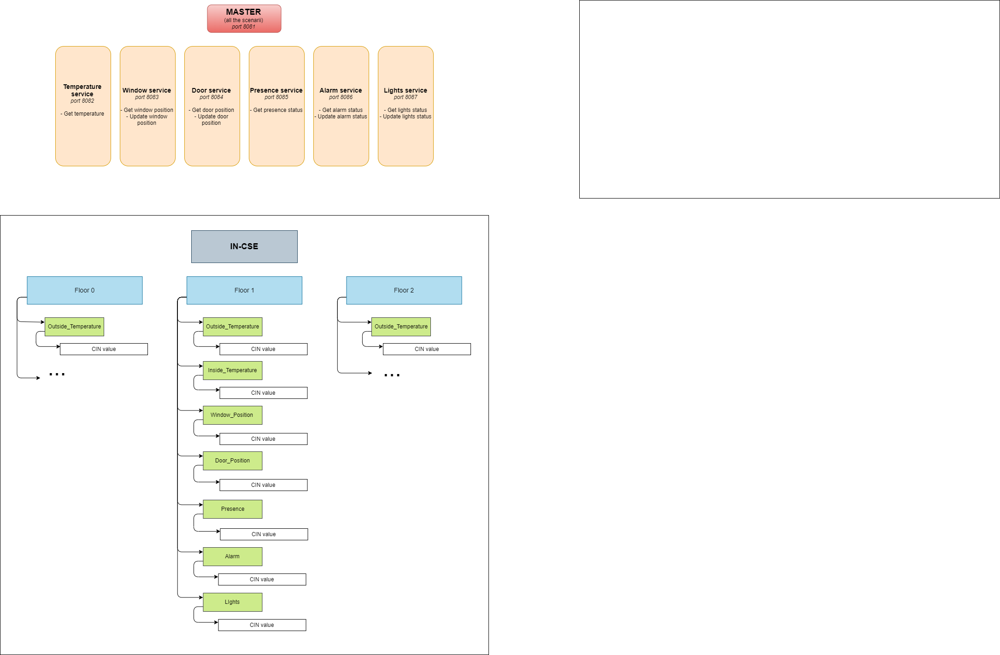
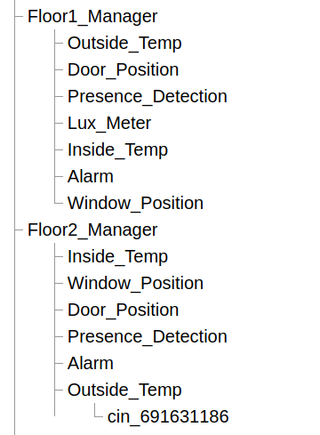
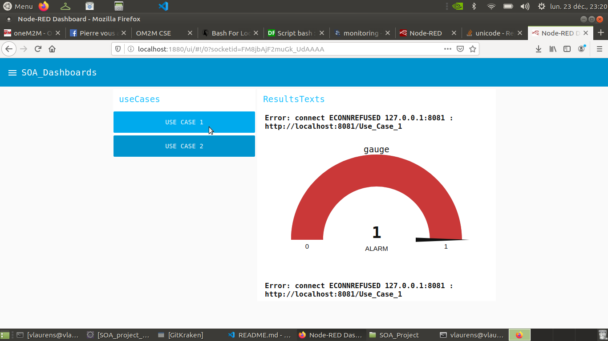

# SOA_Project
5ISS - SOA Project

    Clément Delobel
    Mathilde Cornille
    Vincent Laurens


# OneM2M Architecture




# Files project Hierarchy
```
SOA_Project
│   README.md
│   SOA_Requests_Collection.postman_collection.json
│
└───Alarm (idem for other microservices)
│   │
│   └───libs
|   |   obix.jar
│   │   
│   └───src
│   │
│   └───targets
|   |   Pom.xml
|       
│   
└───generateOneM2MArchi
    │   runOnIN.sh
    │   testArchi.sh
```
 


# How to deploy our infrastructure and application


- First Start the in-cse node of oneM2M
- Then git clone the project repository on your local machine
- Add right to script "runOnIN.sh" which is generateOneM2MArchi folder.
- Now you can check on https://localhost:8080/webpage and login with admin user
  - Or you can run "testArchitecture.sh" on generateOneM2MArchi folder

  You should see the same result as below
  

=> Then open project on eclipse

- Now you can go on each directory on the workspace and execute "mvn package" in order to check dependencies

If you have an obix error then go on eclipse project add obix as external librairy. (the lib is located in folder libs "/SOA_project/{service}/libs")


Finally run `node-red` on your computer:
    So check if you have nodejs installed.
So Then import "SOA_Dashboards.json"
and go on "http://localhost:1880/ui" to see dashboards



Here you go ! OUF 
You are ready to use our app !! 

Thank you and enjoy.


